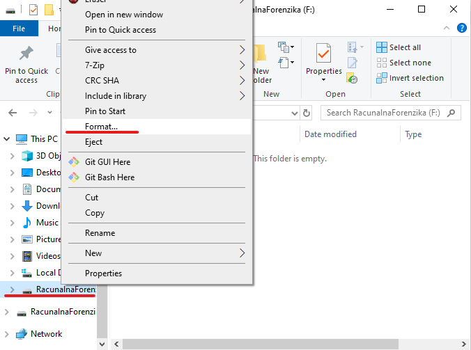
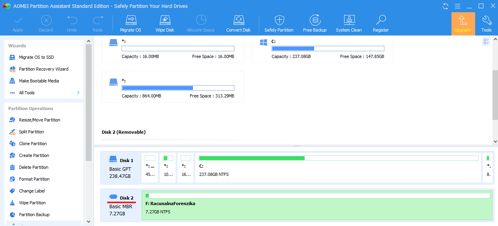
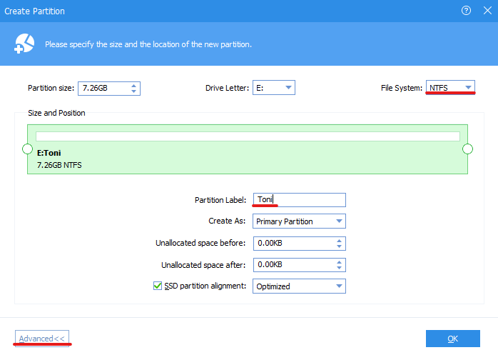
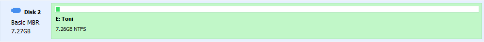
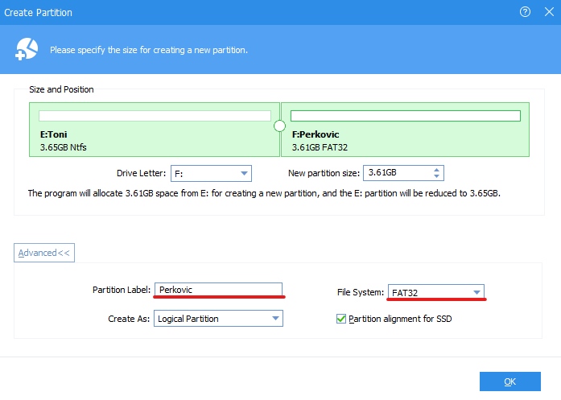
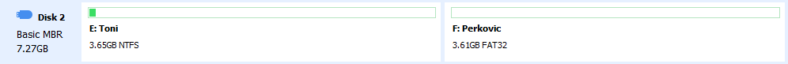

# Lab 1 - Rad s diskovima, particijama, datotekama

U sklopu ove vježbe upoznat ćete se sa radom hard diska, pohranom podataka, datotečnim sustavima i particijama. Za realizaciju laboratorijske vježbe, student će dobiti USB kojeg će koristiti za vrijeme lab. vježbi.

> **NAPOMENA:** ukoliko imate neke bitne podatke na USB-u, vodite računa o tome da ih prethodno pohranite na sigurno mjesto. Umetnite USB u vaše računalo.

## 0. Formatiranja USB uređaja

Da biste formatirali USB u Windows manageru sa lijeve strane locirajte USB uređaj, desnim klikom stisnite na **Format...** te formatirajte USB uređaj (opcija **Quick format**).

 

  

 

## 1. Brisanje particije.

Nakon toga pokrenite prethodno instalirani alat [**AOMEI partition Assitant Standard Edition**](https://www.diskpart.com/free-partition-manager.html). Ako ste umetnuli USB u racunalo trebalo bi Vam se pokazati uz Hard disk na računalu ujedno i USB drive koji ima ikonu sličnu ovoj prikazanu na slici ispod.

 

  

 

Označite USB uređaj te sa lijeve strane u izborniku stisnite na Delete partition. Nakon toga stisnite na Apply u gornjem lijevom uglu kako biste izvršili ovu operaciju.

## 2. Izrada nove NTFS particije.

Označite USB uređaj te sa lijeve strane u izborniku stisnite **Create partition**. Pojavit će vam se novi prozor. U njemu pod File system postavite **NTFS**. Pod opcijama u **Advanced**, pod Partition Label navedite svoje vlastito ime. Kliknite na Ok. Nakon toga u gornjem lijevom uglu glavnog programa kliknite na **Apply**.

 

  

 

Rezultat bi trebao biti sličan na slici ispod.

 

  

 

## 2. Izrada nove FAT32 particije.

Nakon toga kliknite novu kreiranu particiju USB-a i na lijevoj strani kliknite na **Create Partition**. Pod **Advanced** odaberite FAT32 File system, dok pod **Partition label** stavite vlastito prezime.

 

  

 

Nakon toga stisnite Ok, te u lijevom uglu glavnog programa kliknite **Apply** kako biste kreirali novu particiju **FAT32** datotečnog sustava.

 

  

 

## Upravljanje datotekama

Uvjerite se da se na USB-u ne nalazi nikakav sadržaj. Nakon toga kreirajte tekstualnu datoteku (sa ekstenzijom `.txt`) i word datoteku (sa ekstenzijom `.docx`) na obje particije, NTFS i FAT32 te u njih upišite sadržaj. Pitanje:

1) Kolika je fizička veličina datoteke?
2) Kolika je logička veličina datoteke?

> HINT: koristiti `chkdsk` (iz Command Prompt-a sa admin ovlastima), [WinHEX](https://www.x-ways.net/winhex/) alate te `Right click -> Properties` na tekstualnu datoteku kako bi saznali više informacija o datoteci.

