# Lab 3 - Restauracija izbrisanih podataka, kreiranje slike medija

U sklopu ove vježbe student će se upoznati sa postupcima kojima se mogu restaurirati naizgled izbrisani podaci na medija za pohranu. Vidjet ćemo nakon toga koji se komercijalni i dostupni alati koriste za kreiranje slike medija za pohranu, odnosno dokaznog materijala. Na kraju ćemo se dotaknuti i programa koji se upotrebljavaju za sigurno brisanje medija.

## Izrada sigurnosne kopije diska

### FTK Imager

U sklopu ove laboratorijske vježbe ćemo kreirati forenzičnu kopiju diska korištenjem programa `FTK Imager` kojeg možete skinuti sa sljedećeg linka: https://bit.ly/3stClz9. Izrada forenzične kopije diska predstavlja prvi korak u svakoj istrazi te je kritična za ukupan uspjeh forenzične istrage. FTK Imager je alat koji se upotrebljava za izradu slike diska upotrebom jednostavnog GUI-a. Bez ispravne kopije diska, bilo koja daljnja istraga može doći u pitanje. Nakon instalacije programa pokretanjem programa se otvara prozor koji je prikazan na slici dolje. Da bismo
kreirali sliku diska kliknemo na *File* i označimo *Create Disk Image*.

    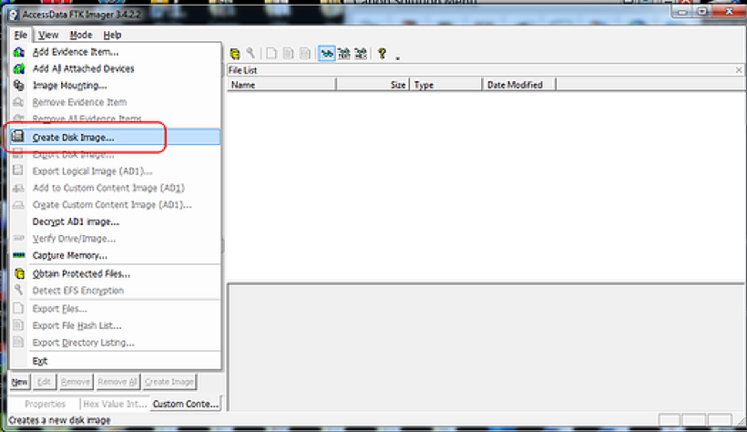
      

Nakon toga će se otvoriti prozor te označite *Physical Drive*.

    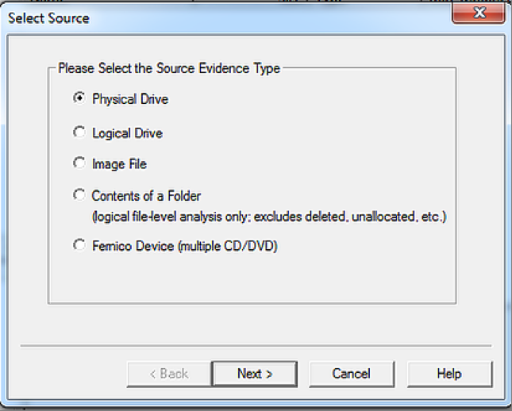
      

Otvorit će Vam se još jedan prozor u kojem ćete moći odabrati lokaciju uređaja. U ovom slučaju smo odabrali *General USB Flash Disk*, dok se kod vas to može razlikovati.

    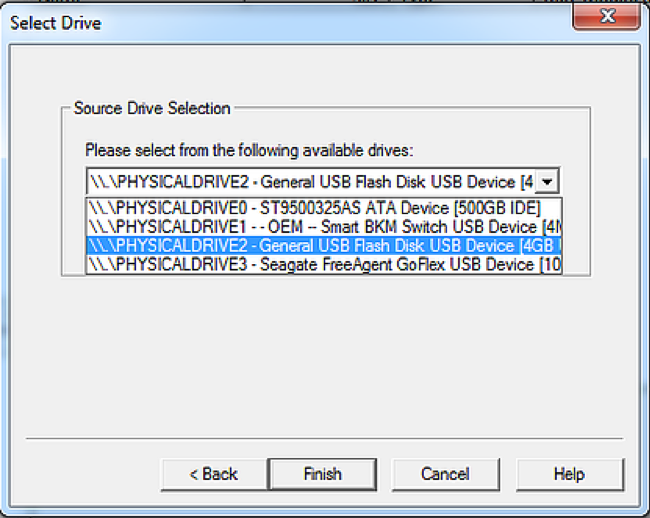
      

Kliknite *Finish* nakon odabira uređaja. Nako toga trebate odabrati *Image Destination*. Kliknite *Add*. Primjetite u donjem lijevom kutu da želite potvrditi (eng. *verify*) kreiranu image datoteku.

    
      

Nakon toga ćete dobiti obavijest o tipu image file-a kojeg želite kreirati. Označite `Raw` ili `dd` image.

    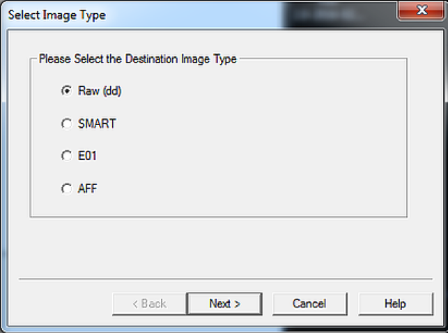
      

Nakon što smo unijeli sve te informacije *FTK imager* nas obavještava da kreiramo slučaj. Za kreiranje slučaja je potrebno:
- a case number
- evidence number
- a unique description
- the examiners name
- notes

    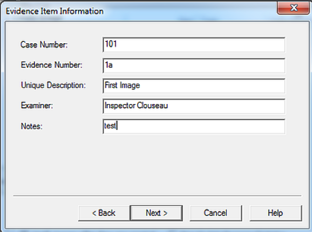
      

Ubacite adekvatne informacije i kliknite *Next*. Nakon toga ćete dobiti obavijest o destinaciji na koju želite sačuvati image datoteku. U ovom primjeru je image sačuvan u direktoriju `c:\forensic images` dok je ime image datoteke `toni_perkovic.dd`.

    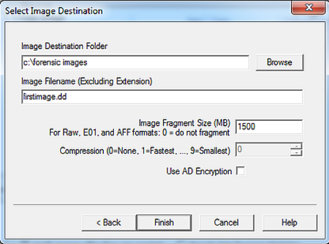
      

Nakon toga kliknite *Finish* gdje će Vas vratiti na *Create image* prozor. Kliknite *Start*.

    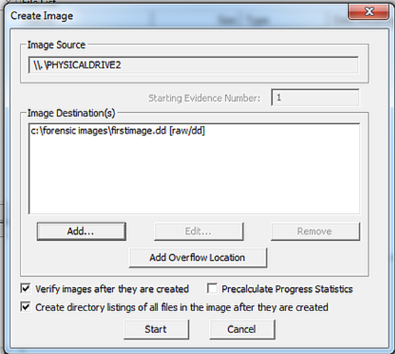
      

FTK Imager započinje proces kreiranja kopije diska.

    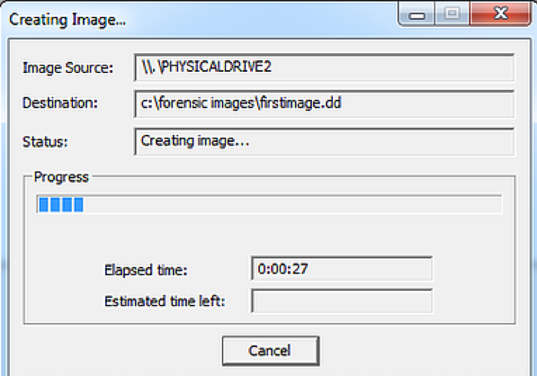
      

Nakon usješno kreiranog image datoteke dobit ćete poruku *Image created successfully*. Nakon toga će FTK Imager započeti sa provjerom autentičnosti kreiranog image-a da bi potvrdio kako je kreiran image identičan originalu. 

    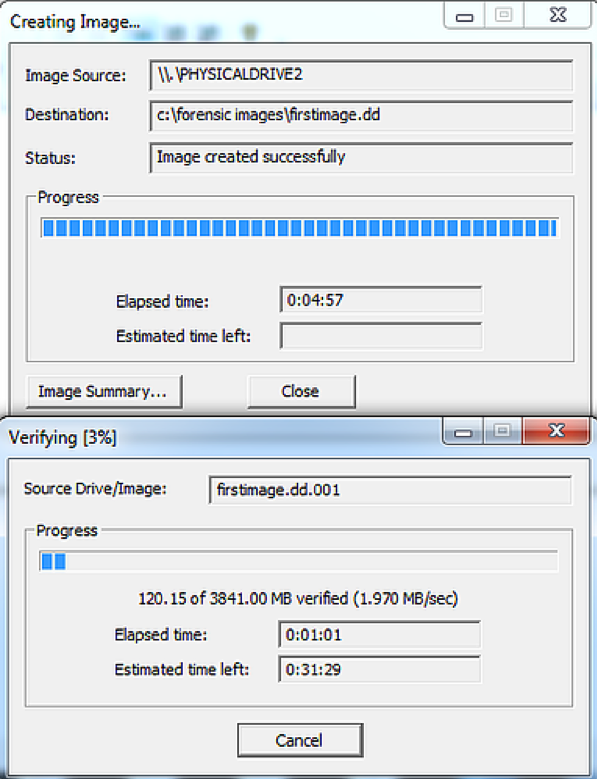
      

Kada ste kreirali sliku diska kliknite na *Image Summary* nakon čega će Vam se otvoriti prozor koji sumira statistiku izrade slike koja uključuje se bitne hash-eve kao što su prikazani dolje.

    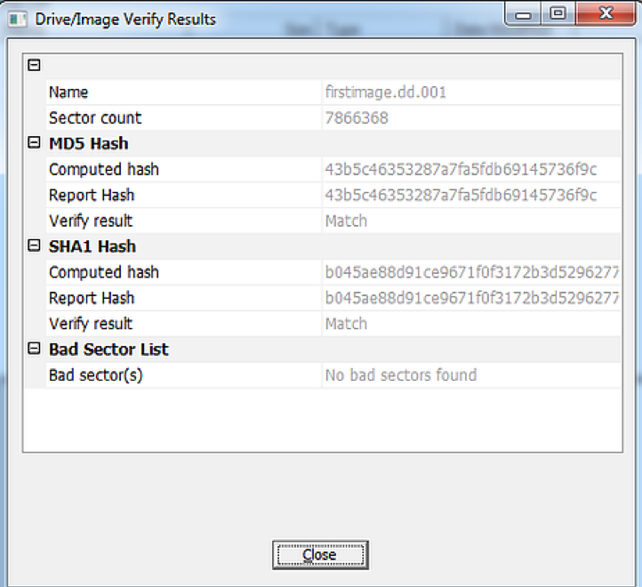
      

Uspješno smo kreirali sliku USB uređaja, provjerili smo autentičnost kopije koja je identična originalu tako da smo generirali oboje MD5 i SHA1 hash od originala diska i kopije diska.

## Restauracija izbrisanih podataka

U sklopu ove laboratorijske vježbe ćemo povratiti datoteke koje je osumnjičenik kreirao. Jedna od osnovnih vještina koje forenzični istražitelji moraju imati je obnavljanje izbrisanih datoteka. Kao što možete znati, „izbrisane“ datoteke ostaju na mediju za pohranu sve dok se ne prebrišu sa novim podacima. Brisanjem tih datoteka dajete informaciju sustavu da je dio memorije slobodan za upis novih podataka. To ujedno znači ako je osumnjičenik izbrisao dokaz, oni ostaju prisutni u memoriji i dostupni su za povrat.

Osumnjičenici veoma često žele zataškati svoje tragove brisanjem ključnih datoteka. Kao forenzični istražitelji trebamo znati da "izbrisani" podaci većinom ostaju sačuvani na računalu sve dok se ne prebrišu novim podacima. Korištenjem alata kao što su *Autopsy* te niz drugih paketa povrat podataka (*Encase, ProDiscover, FTK, Oxygen*, itd.) je trivijalan.

U sklopu ove laboratorijske vježbe ćemo upotrebljavati *The Sleuth Kit (TSK)* za identifikaciju i obnovu izbrisanih datoteka. *The Sleuth Kit (TSK)* je isprva bio napravljen za Linux ali je odnedavno napravljen i za Windows-e. U sklopu ove vježbe ćemo upotrebljavati GUI sučelje pod nazivom *Autopsy*. Možete ga skinuti sa sljedećeg linka: https://www.sleuthkit.org/autopsy/download.php

    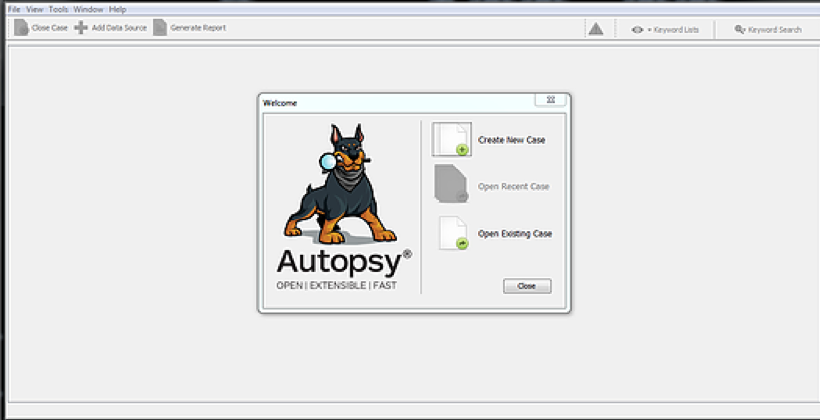
      

Nakon instalacije i pokretanja programa kliknite na *Create New Case*. Nakon toga će Vam se pokazati prozor u kojem ćete unijeti novi slučaj kao i direktorij u kojeg želite pohraniti taj slučaj. U našem slučaju je unešeno *New Case 101* te je sačuvan u direktoriju `C:\Cases`.

    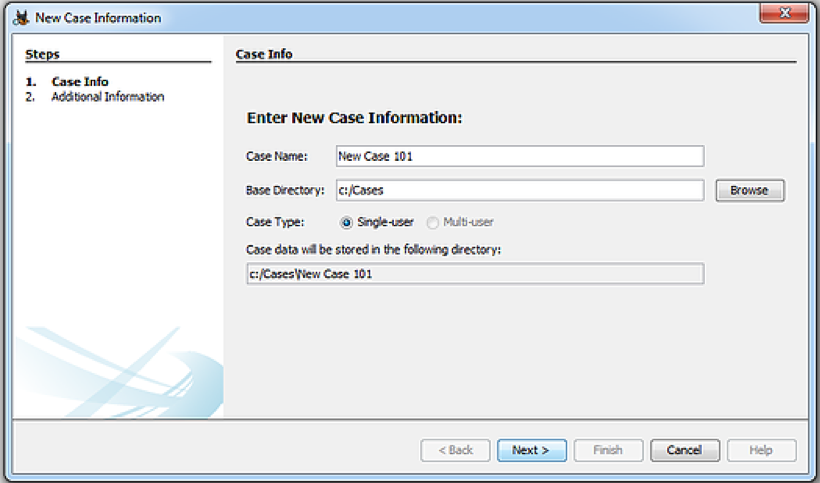
      

Klikom na Next se otvara novi prozor u kojem vas pita za broj case-a kao i ime ispitivača. Unesite broj 101 te ime ili inicijale ispitivača.

    
      

Nakon toga kliknite na *Finish*.

Kliknite na *Add New Data* u gornjem lijevom kutu te će Vam se otvoriti prozor *Add Data Source*. Kako ćemo upotrebljavati sliku (image) medija koju smo kreirali u prethodnoj vježbi, odaberite *Image File* te označite datoteku slike koju ste kreirali u prethodnoj vježbi. Ako se sjetite, slika je spremljena u direktoriju `C:\forensic images`.

    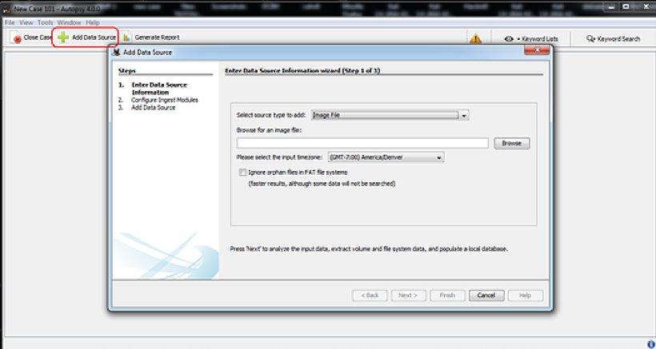
      

Nakon toga dodajte sliku `firstimage.dd` koju će vam pripremiti profesor.

    
      

Nakon dodavanja slike kliknite *Next* te će program Autopsy započeti sa analizom slike. Nakon toga će se prikazati poruka na slici ispod. Odaberite *Finish*.

    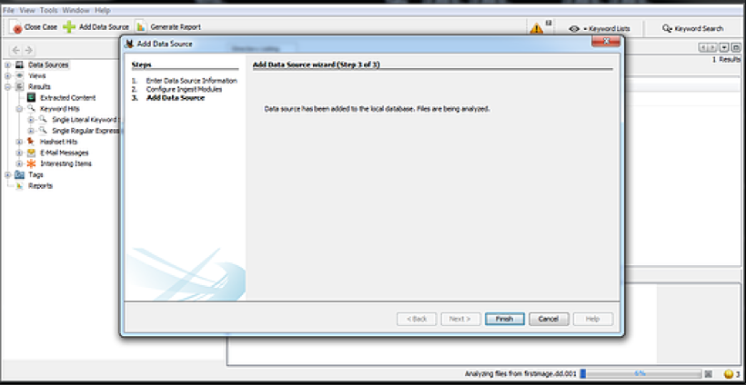
      

Trebati biste vidjeti sučelje kao što je prikazano ispod. Primijetite da se pojavio `firstimage.dd`.

    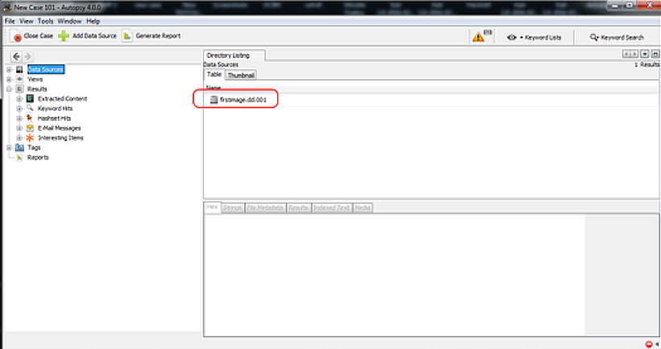
      

Ako proširimo *File Types* u exploreru, Autopsy je prikazati sve tipove podataka kao i broj podataka u svakoj kategoriji. Ispod možete vidjeti da je označeno polje *Images* nakon čega će Autopsy prikazati sve podatke.

    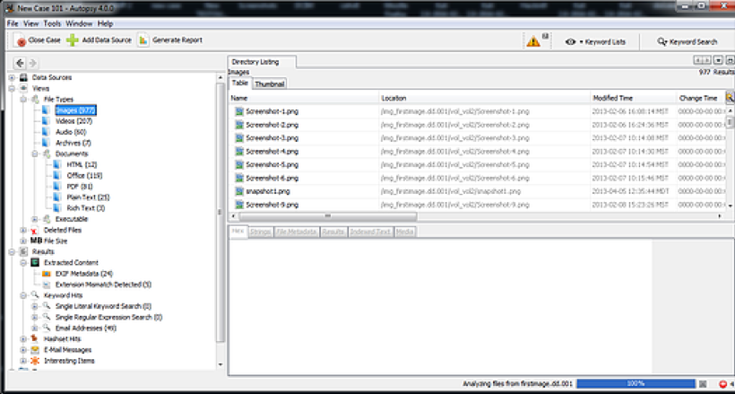
      

Možete primijetiti podatke pod nazivom *Deleted Files*. Kada kliknemo na njih prikazat će Vam se sve izbrisane datoteke.

    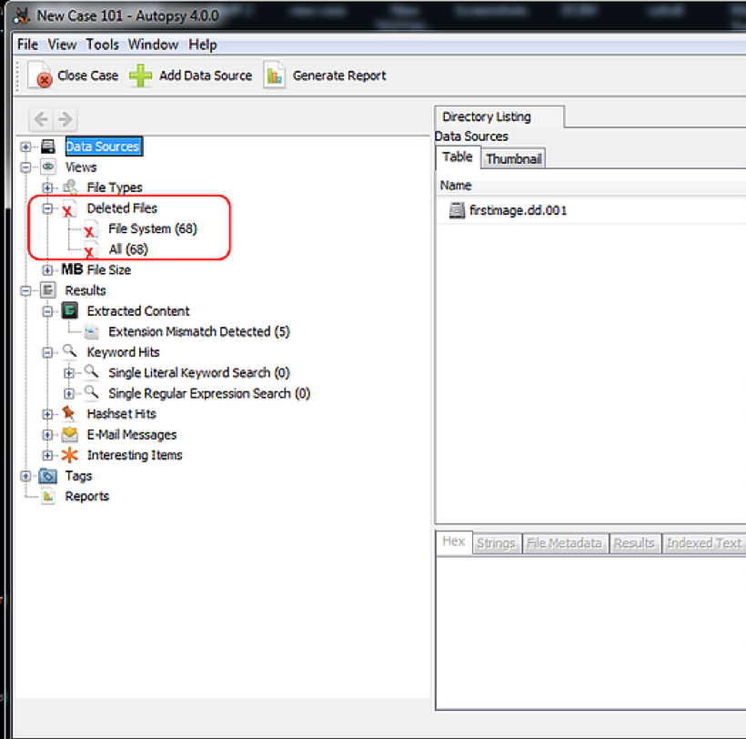
      

Kada kliknemo na izbrisanu datoteku možemo u donjem desnom prozoru napraviti analizu. Nakon toga će se prikazati `tabs labeled`, `Hex`, `Strings`, `File Metadata`, `Rezultati` te `Ubačeni Tekst`. U tom slučaju, klikni na *File Metadata* tab te će se prikazati metapodaci koji uključuju ime, tip, veličinu, kada je datoteka izmijenjena, kada je njoj pristupano te kada je kreirana.

    
      

Kad bi povratili podatke, označimo datoteku te kliknemo na *Export*. Nakon toga će se otvoriti prozor koji je prikazan ispod.

    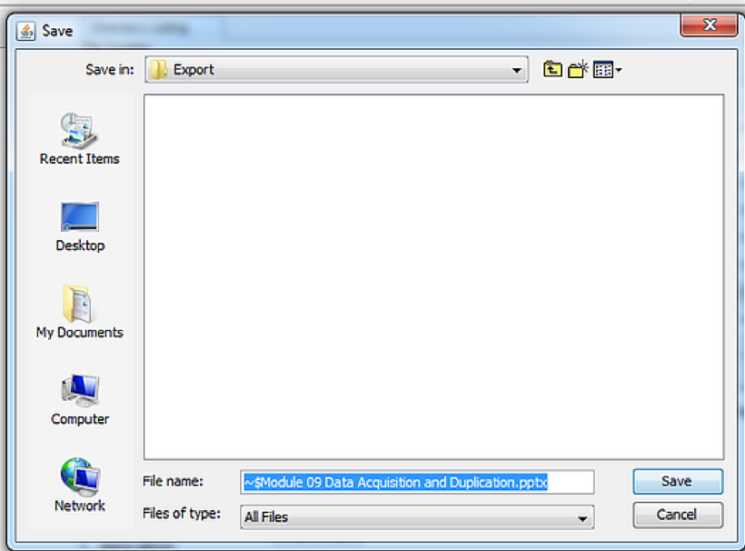
      

Sačuvajte datoteku u poddirektoriju *Export* koji se nalazi (u našem slučaju) u: `C:\Cases\New Case 101\Export`

    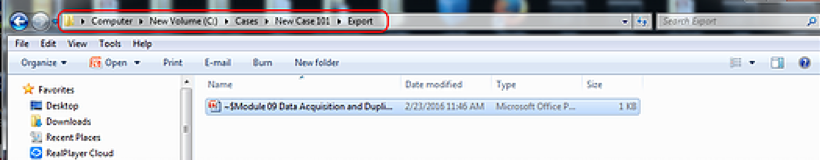
      

Dvostrukim klikom na datoteku je možete otvoriti u odgovarajućoj aplikaciji.

## Sigurno brisanje sadržaja sa medija za pohranu (preporuka ne raditi kod kuće!)

Danas postoji veliki broj programa koji nude mogućnost sigurnog brisanja sadržaja sa medija, a mi ćemo u sklopu ove vjezbe upotrebljavati programski alat *Eraser*. Eraser možete skinuti sa sljedećeg linka: https://sourceforge.net/projects/eraser/

    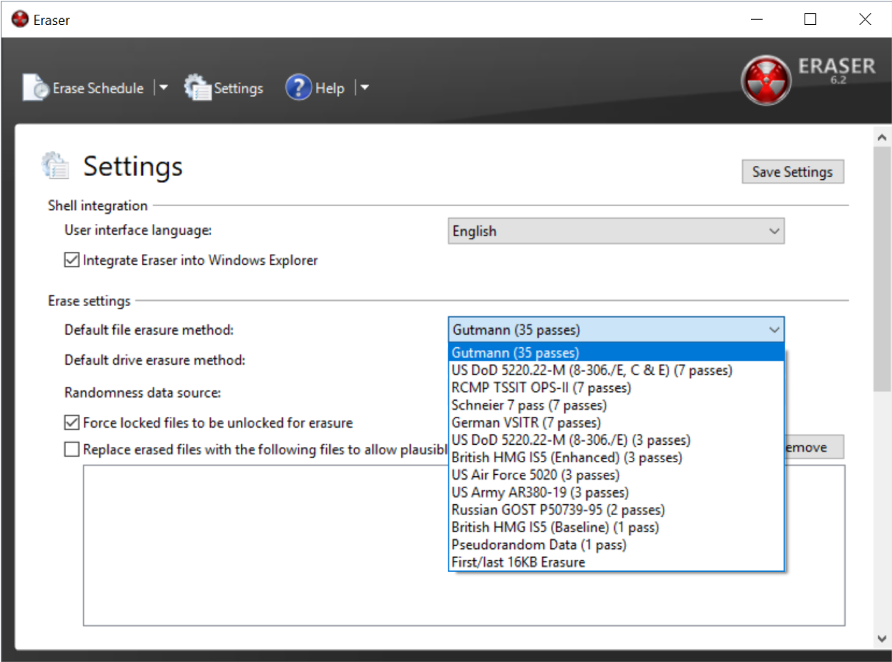
      

Korištenjem ovog alata ćemo izbrisati cjelokupni sadržaj sa USB-a. Nakon što to napravimo, ponovite cijelokupni postupak za izradu sigurnosne kopije putem FTK Imager alata i rada sa slikom medija preko Autopsy alata.
