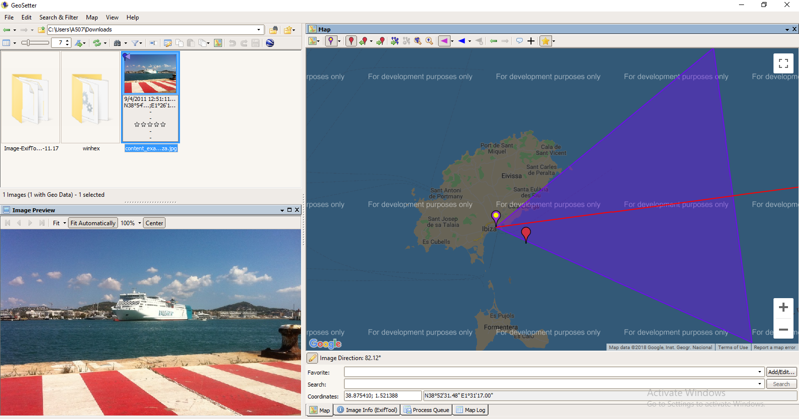
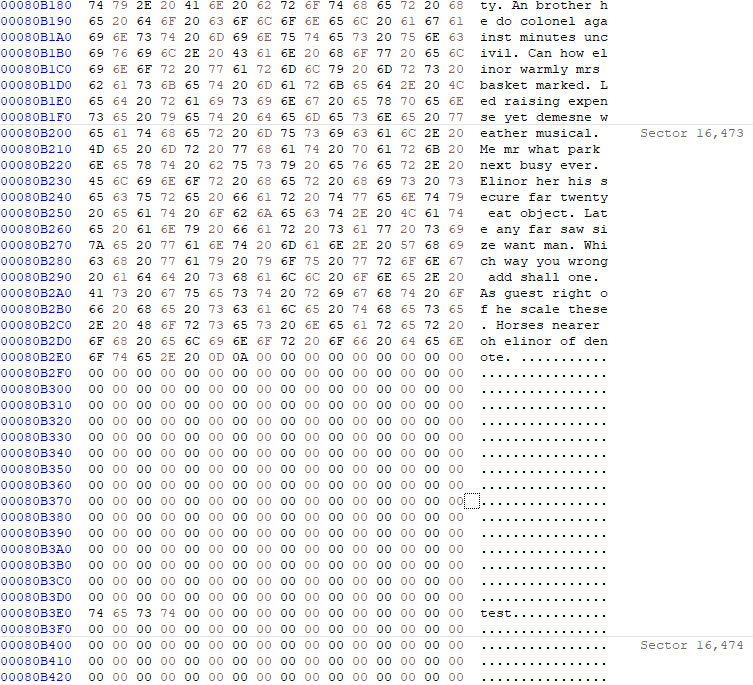
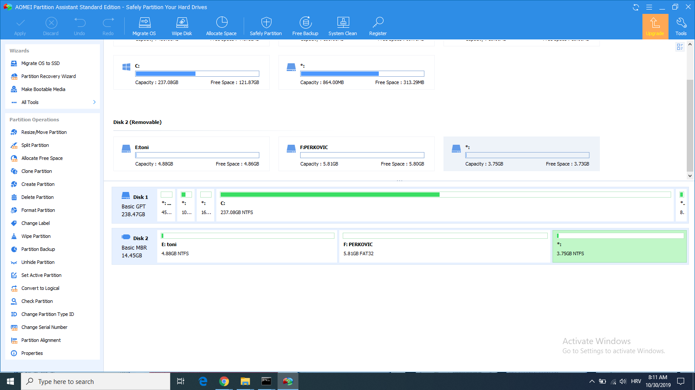
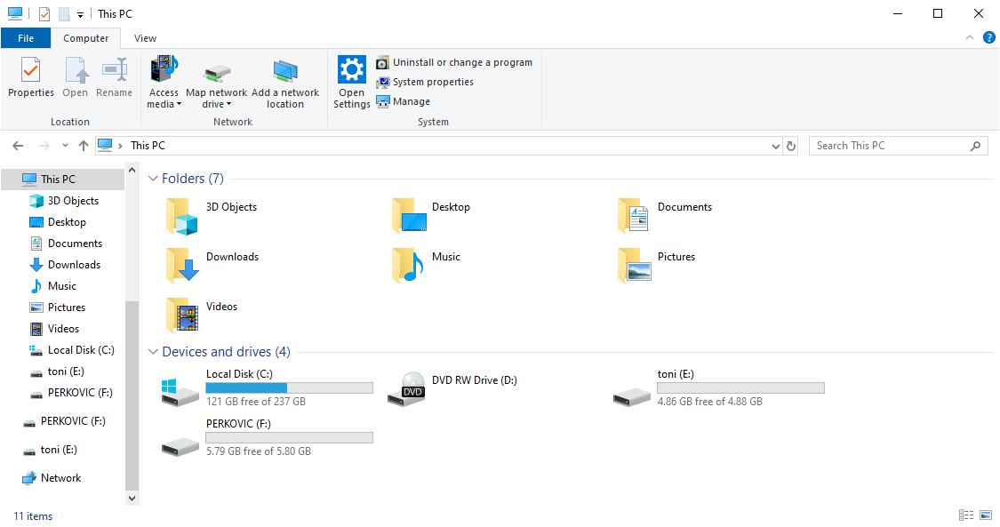
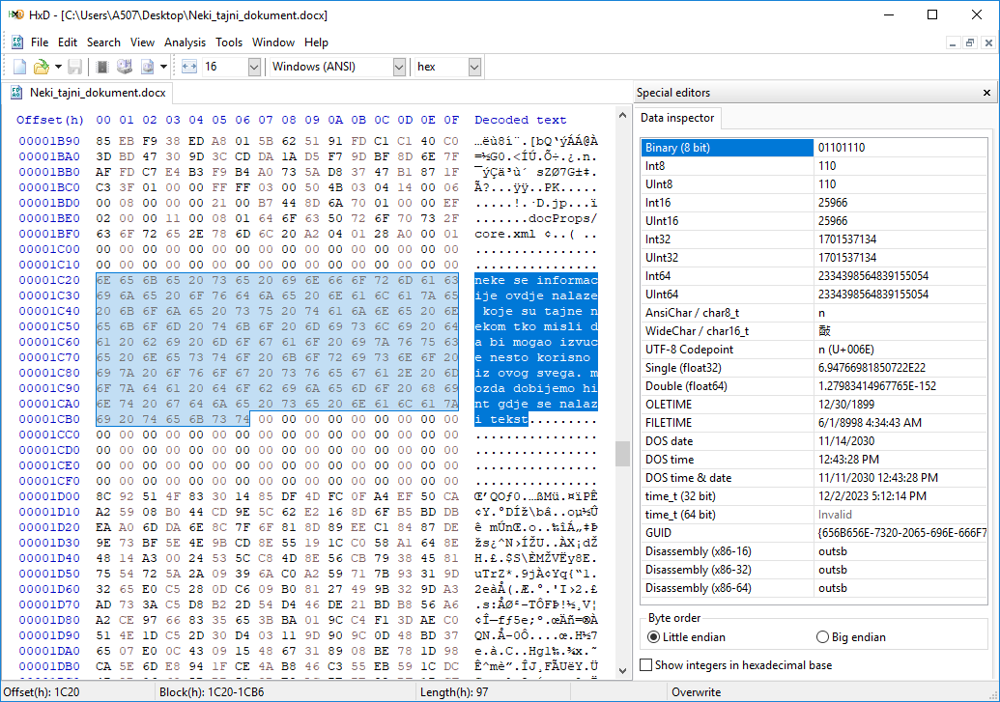
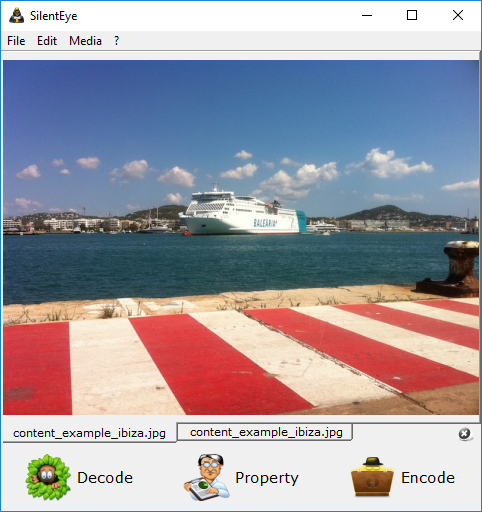
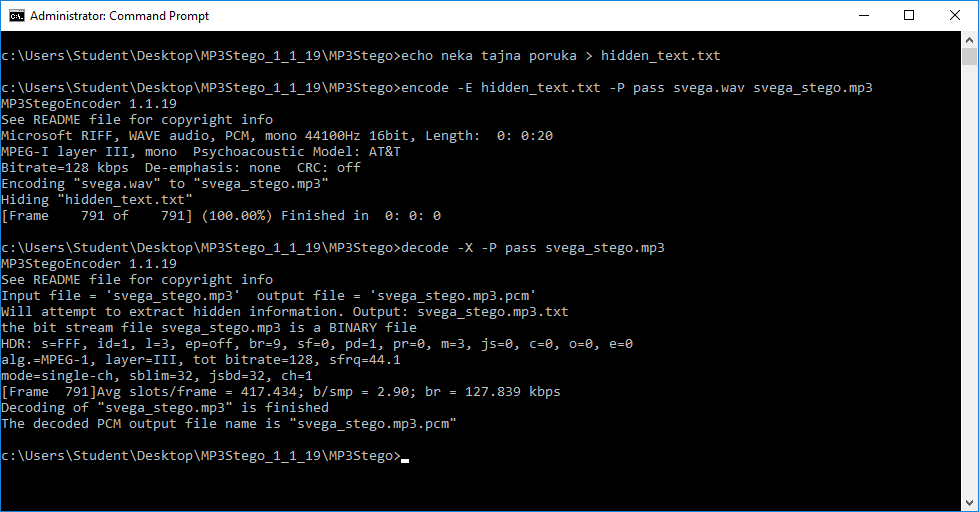

# Lab 5 - Steganografija i Metapodaci

U slopu današnje vježbe upoznat ćemo se sa pojmom *Steganografija*, vidjet ćemo sto je to *Metadata* kod podataka pohranjenih na računalu te na koji način nam podaci o podacima mogu pomoći prilikom forenzične istrage.

## Metadata 

U ovom primjeru ćemo vidjeti koje sve informacije mogu biti pohranjene sa datotekama koje mogu biti od područje interesa forenzične istrage. Za potrebe ove vježbe ćete skinuti dvije datoteke ekstenzija `.vav` i `.jpg` te ćete analizirati metapodatke koji su sadržani u njima. Datoteke se nalaze u direktoriju [Files](Files) te ih skinite na svoje računalo.


Desnim klikom na svaku od datoteka te klikom na `Properties` pokušajte saznati što više informacija o tim datotekama. Možete li dati više informacija o navedenim datotekama (npr. kada je kreirana, modificirana, s kojim fotoaparatom je slikana, rezolucija fotoaparata).

<p align="center">
    
    <br><br>
</p>

Korištenjem alate GeoSetter vidite možete li saznati više informacija o slici. GeoSetter možete skinuti i instalirati sa sljedećeg linka: https://www.geosetter.de/en/download-en/

## Skrivanje sadržaja u *Slack space*

*Slack space* je prostor između logičkog kraja i fizičkog kraja datoteke te se naziva ujedno i file slack. U sklopu ovog dijela vježbe student će kreirati `.txt` datoteku duljine najmanje dva klastera (2x4096 byte-a), upisati u nju neki sadržaj te spremiti datoteku na USB uređaj (USB formatirajte na NTFS datotečni sustav sa 4096 byte klasterima). Na USB-u kreiraje uz original i kopiju tekstualne datoteke te se uvjerite koji su metapodaci isti, te koji se razlikuju i zašto. Također se uvjerite je li hash analizom SHA256 otisak obaju datoteka isti. Korištenjem [HxD](https://mh-nexus.de/en/hxd/) HEX editora otvorite sadržaj USB uređaja, pronađite fizički kraj datoteke, odnosno slack space, te upišite u nju neki sadržaj. Provjerite hoće li hash otisak dvaju datoteka biti isti nakon što ste u jednu manipulirali sadržajem *slack space*-a
> HINT: koristite alate fciv za provjeru hash otiska dvaju datoteka, te HxD editor za upisivanje sadržaja u slack space

<p align="center">
    
    <br><br>
</p>


## Skrivanje particija

U ovom dijelu vježbe ćemo se upoznati sa postupkom skrivanja particija na USB disku. Korištenjema programa AOMEI Partition Assistant krerajte uz minimalno jednu primarnu particiju još jednu, u nju upišite/kreirajte nkei sadržaj te je sakrijte. Je li navedena particija vidljiva kada otvorite **This PC**.

<p align="center">
    
    <br><br>
</p>

<p align="center">
    
    <br><br>
</p>

## Steganografija - skrivanje sadržaja u `.docx` dokumente

U navedenom primjeru ćete vidjeti kako je jednostavno moguće sakriti sadržaj u *Word* dokument.

Kreirajte *Word* dokument sa nekim sadržajem u njemu. Nakon toga u alatu HxD otvorite netom kreirani Word dokument te u praznom polju (eng. *empty space*) dokumenta napunite dokument sa sadržajem kao što je navedeno u slici ispod.

<p align="center">
    
    <br><br>
</p>

Nakon toga sačuvajte dokument, provjerite možete li ga otvoriti u *Word* programu. Ukoliko je to moguće, pošaljite kolegi do sebe na mail te testiraje može li kolega otvoriti dokument u *HxD* programu i saznati 'skriveni' sadržaj.

## Steganografija - skrivanje sadržaja u slike

Također je moguće sakriti podatke u slike poput programa kao što je SilentEye koji je dostupan na: https://silenteye.v1kings.io, koji kao što možete vidjeti u uputama, omogućava skrivanje informacija u slikovni sadržaj uz prethodno enktiptiranje.

<p align="center">
    
    <br><br>
</p>

Vaš zadatak je sakriti podatak-tekst u sliku, poslati sliku kolegi do sebe na mail. Ukoliko ste prethodno razmijenili ključeve za enkripciju tajnog sadržaja, pokušajte dekriptirati i dekodirati sadržaj.

## Steganografija - skrivanje sadržaja u MP3 datoteke

U ovom primjeru ćemo sakriti tekst u zvučni sadržaj korištenjem MP3Stego programa kojeg možete skinuti sa sljedećeg linka: https://www.petitcolas.net/steganography/mp3stego/. Program raspakirajte na *Desktop* te se preko *Command prompt-a* pozicionirajte na MP3Stego direktorij kojeg ste prethodno raspakirali na *Desktopu* (npr: `C:\Users\Student\Desktop\MP3Stego_1_1_19\MP3Stego`). U notepad-u kreirajte neki sadržaj te ga pohranite u datoteku `hidden_text.txt` u direktorij `MP3Stego`. Alternativno tajnu poruku možete kreirati kao što je dano u slici ispod: 

```bash
echo neka tajna poruka > hidden_text.txt
```

<p align="center">
    
    <br><br>
</p>


Sakrijte tekstualnu datoteku u zvučni sadržaj `svega.wav` korištenjem MP3Stego programa:


```bash
encode -E hidden_text.txt -P pass svega.wav svega_stego.mp3
```

Kao rezultat kodiranja je nastao `.mp3` datoteka *svega_stego.mp3*, dok je za enkripciju teksta korišten pass kao tajni ključ. Kao i u prethodnom primjeru pošaljite datoteku kolegi do sebe na mail te vidite hoće li moći dekriptirati, dekodirati i saznati sadržaj koji je pohranjen u `.mp3` datoteci.

```bash
decode -X -P pass svega_stego.mp3
```

